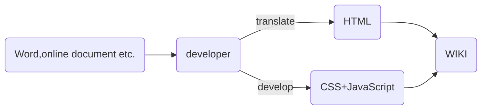
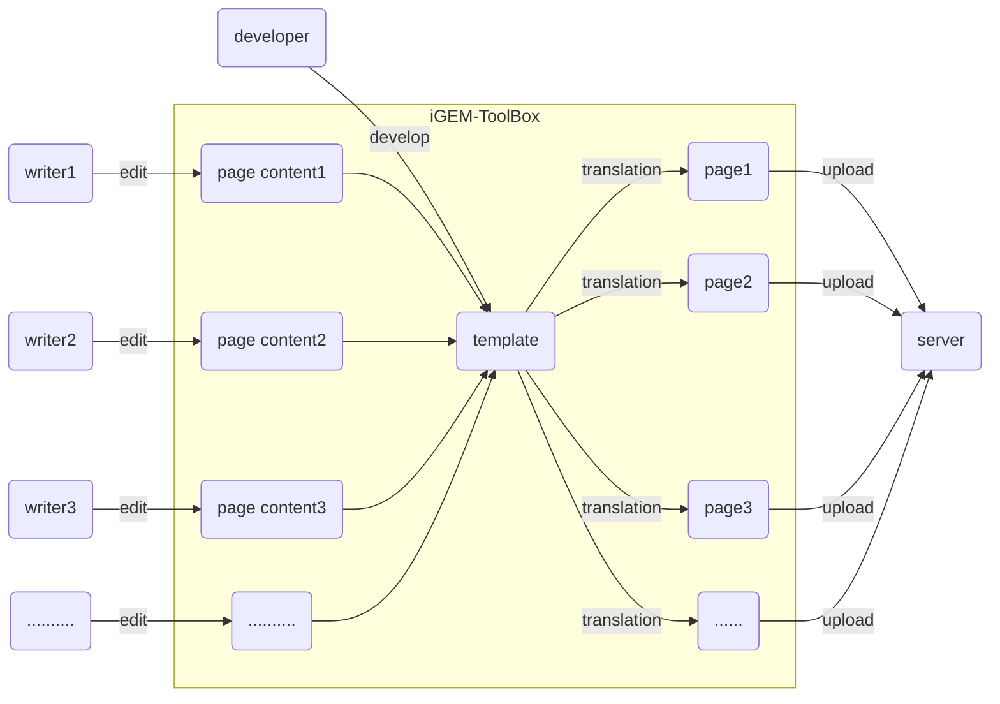

# iGEM-ToolBox

- [iGEM-ToolBox](#igem-toolbox)
  - [项目简介](#项目简介)
    - [为什么](#为什么)
    - [怎么做](#怎么做)
    - [技术栈](#技术栈)
  - [TODO](#todo)
  - [项目运行](#项目运行)
    - [热加载模式运行](#热加载模式运行)
    - [构建软件包](#构建软件包)

## 项目简介

一个旨在优化iGEM工作流程的项目,正在开发中。
工具箱计划包含用于WIKI内容编辑的富文本编辑器（WIKIEditor）、团队及成员信息收集、比赛日程、支持运行python编写的合成生物学相关软件等。

### 为什么

每年，我们在进入比赛的后期面临的最大的问题便是材料的完善与上传（包括WIKI的编写与上传、parts的上传等等），其中，WIKI的编写更是一项繁重的任务。而我们传统的工作模式如下图。



这样的工作模式的工作效率直接取决于开发人员的生产力，但不幸的是，对于大多数参赛队伍，他们的开发人员是有限的，能力也参差不齐。同时，由于HTML本身的特性，它对于人类的阅读与修改是极不友好的，这导致了工作流程中修改的成本是高昂的（有时开发人员需要在数千行代码中找到相应的修改内容，甚至当相应页面的内容完全更改时，开发人员需要重新编写HTML文件）。这无疑是一种极为低效的工作模式。本项目便是为了改变这样的工作模式而开始的。

### 怎么做

基于上述原因，本项目期望提供一种简便的方式(类似于日常使用的word，而不是去学习一门新的语言，哪怕它十分简单)使得没有编程基础的成员也能轻松编辑网页内容，以形成如下的工作模式。



富文本编辑器无疑是一种选择，但现有的富文本编辑器只能勉强满足我们的需求，它们或多或少会缺乏一些我们所需求的功能（如文献引用、公式等）并且不够自由。因此，本项目打算基于[tiptap2](https://tiptap.dev/)开发一款更适用于编辑iGEM WIKI的富文本编辑器。

在此基础上，本项目期望集成其他的一些在比赛中可能需要的功能形成一个工具箱。

### 技术栈

- [tiptap2](https://tiptap.dev/)
- [vue 3.0.0](https://vue3js.cn/)
- [electron 13.0.0](https://www.electronjs.org/)
- python
- [node](https://nodejs.org/en/)
- [element-plus](https://element-plus.org/zh-CN/)

## TODO

- TipTapEditor
  - [x] 行内数学公式
  - [x] 块级数学公式
  - [ ] 文献引用
  - [ ] 图片插件完善
  - [ ] 自定义Attributes
  - [ ] 代码视图
  - [ ] 代码格式化
  - [ ] markdown支持
  - [ ] word导入
  - [ ] word导出
  - [ ] 自动上传
  - [ ] 插入视频
- 其他
  - [ ] 主题切换
  - [ ] 登录iGEM账号
  - [ ] 团队及成员信息收集
  - [ ] 比赛日程获取

## 项目运行

想要运行该项目，首先需要确保安装了[node](https://nodejs.org/en/)

将该项目clone到本地后，运行

```node
npm install
```

下载依赖

### 热加载模式运行

```node
npm run electron:serve
```

### 构建软件包

```node
npm run electron:build
```
