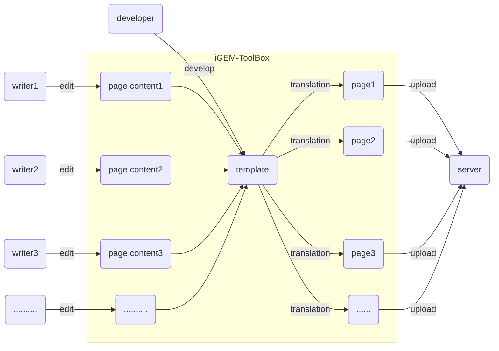

# What is iGEM-ToolBox

This project was developed to help edit wikis more efficiently.

```mermaid
graph LR
    writer1(writer1) --edit--> content1(page content1)
    writer2(writer2) --edit--> content2(page content2)
    writer3(writer3) --edit--> content3(page content3)
    omitwriter(..........) --edit--> omitcontent(..........)
    developer(developer) --develop--> template(template)
    subgraph iGEM-ToolBox
      content1 --> template
      content2 --> template
      content3 --> template
      omitcontent --> template
      template --translation--> page1(page1)
      template --translation--> page2(page2)
      template --translation--> page3(page3)
      template --translation--> omitpage(......)
      end
    page1 --upload-->server(server)
    page2 --upload-->server
    page3 --upload-->server
    omitpage --upload-->server
```
$ \sigma $